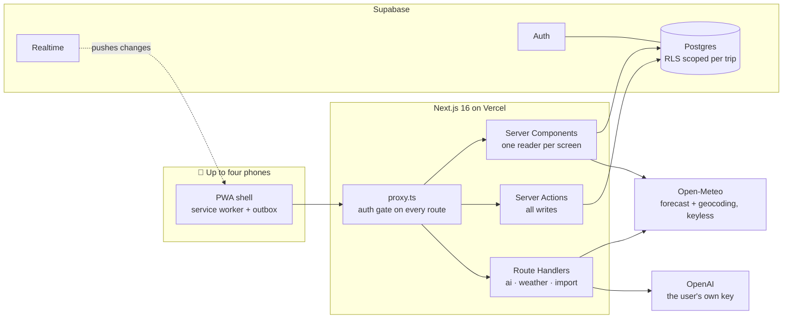
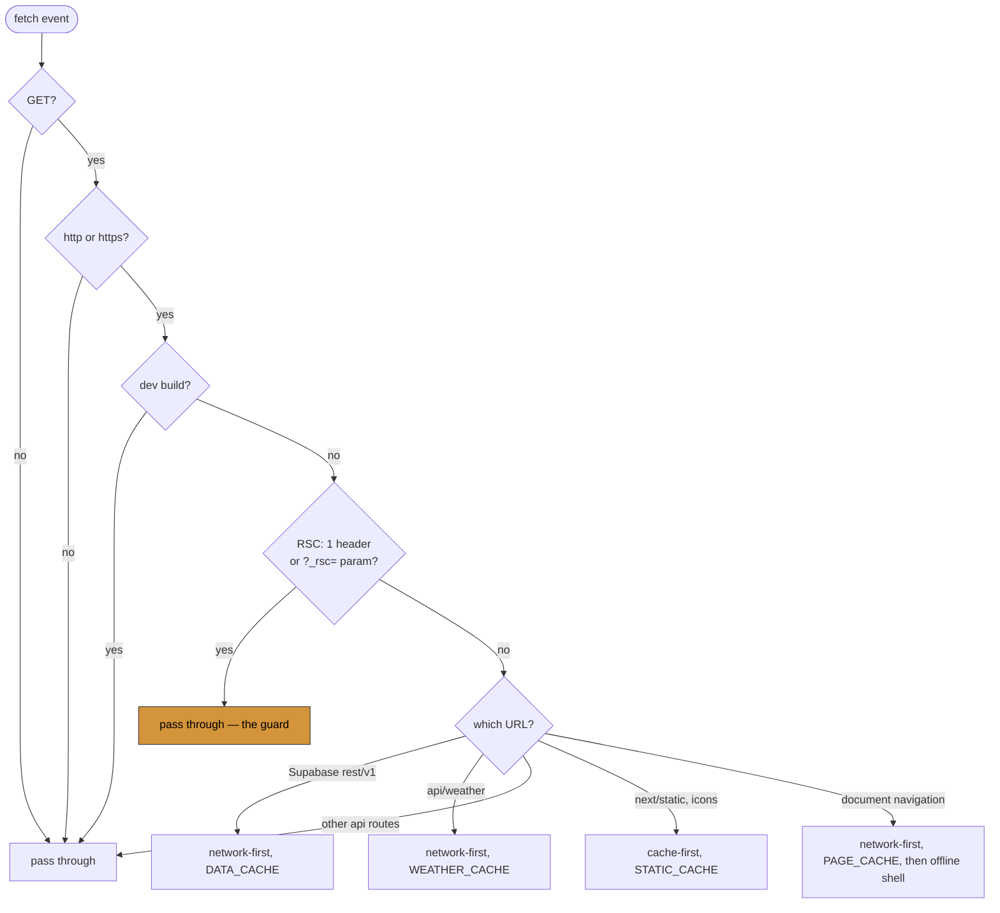
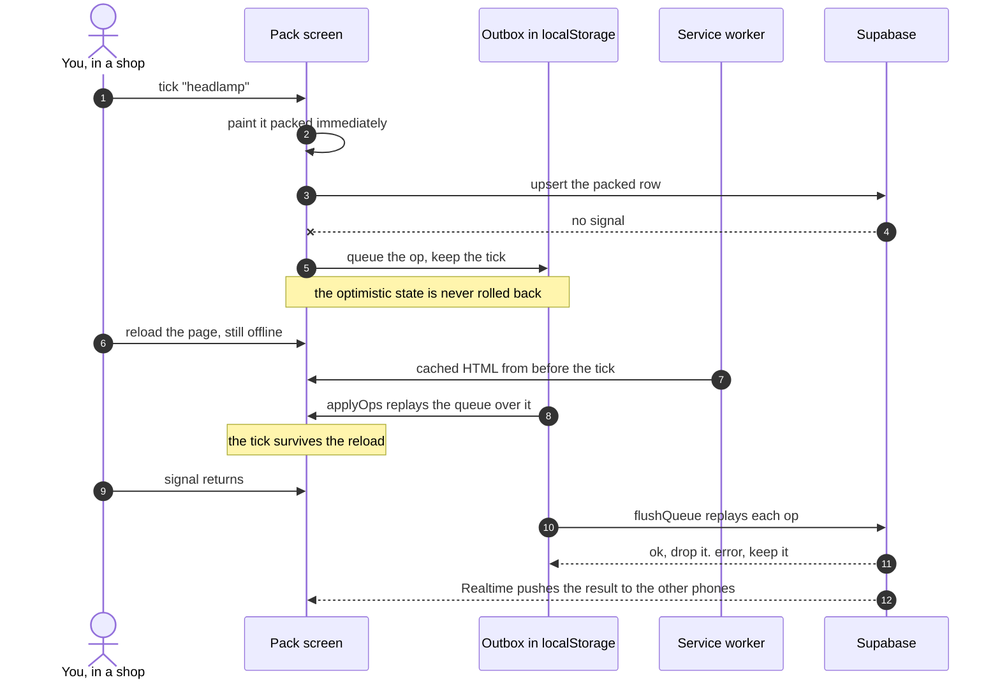

<div align="center">

# 🐂 YakPack

**An offline-first packing and itinerary companion for the mountains.**

Weather-aware packing · a shared list for up to four people · an AI guide you bring your own key for

[](https://github.com/kritish08/yakpack/actions/workflows/ci.yml)
[](LICENSE)
[](https://nextjs.org)
[](#testing)

[yakpack.tech](https://yakpack.tech) · [Terms](https://yakpack.tech/terms) · [Privacy](https://yakpack.tech/privacy)

</div>

---

## Contents

- [What it does](#what-it-does)
- [Architecture](#architecture)
- [The decision worth reading first](#the-decision-worth-reading-first)
- [Ticking something off with no signal](#ticking-something-off-with-no-signal)
- [Four more decisions](#four-more-decisions)
- [Repo structure](#repo-structure)
- [Quick start](#quick-start)
- [Environment](#environment)
- [Roles and data](#roles-and-data)
- [Testing](#testing)
- [What's imperfect](#whats-imperfect)
- [Tech stack](#tech-stack)
- [Licence](#licence)

---

## What it does

I wrote it for one specific trip: nine days from Delhi into the Spiti Valley and back, climbing from 216 m to 4,590 m at Kunzum La, with two days where the itinerary's own notes record the signal as "near-zero" and then gone entirely.

Packing for that with other people is genuinely awkward. You carry a down jacket you will not touch for four days and a headlamp you need at exactly one campsite. Half the kit is shared and should only be carried once. And the day the packing matters most is the day you cannot reach the internet.

So the trip became the spec.

- **Weather-aware packing.** Items carry tags. Below 5 °C or above 4,000 m the cold layers surface on their own; rain probability at or above 50 % pulls the cover out; a UV index of 6 or more pulls the sunscreen. The thresholds live in [`lib/weather.ts`](lib/weather.ts), not in a prompt.
- **Four people, one list.** An organiser plus up to three partners, invited by link. Items belong to one person or to everyone: personal items track a packed state each, shared items track one between the group. Changes arrive on the other phones over Supabase Realtime.
- **Genuinely offline.** The pack list, plan, and last-known forecast stay readable with the radio off. Check-offs made offline are queued on the device and replayed on reconnect — and they are never rolled back.
- **Altitude-aware.** `lib/ams.ts` derives acute-mountain-sickness risk from the day's altitude gain with no AI involved, so the warning still works with the network off.
- **Pemba, the AI guide.** Reads the real itinerary, live weather, and packing state before answering. It can add items — every write stops at a confirmation sheet first.
- **Bring your own key.** Pemba runs on the user's own OpenAI key, held in the browser and passed per request. It is never written to the database. The deployment's own key is reserved for the admin account, so nobody else can spend it.
- **Start a trip however you like.** Upload a PDF, paste a link to an itinerary, build it by hand, or copy the seeded example. The link importer works without any AI key at all.
- **A small admin panel.** The operator can list accounts, rename them, set a password, grant or revoke admin, and delete an account with everything it owns.

---

## Architecture



Reads go through one `getXData()` per screen in `lib/`, each parallel-fetching under RLS with the cookie-bound client. Writes are server actions that re-check the session and sanitise free text before it can reach a prompt. Weather is fetched server-side directly rather than by the server calling its own `/api/weather` — building an internal URL from the `Host` header is an SSRF vector.

---

## The decision worth reading first

**A service worker that must not cache the framework's own navigation.**

The obvious service worker has a catch-all branch: try the network, fall back to the cache, and cache whatever comes back. I wrote that one. It broke the app in both directions, and the online direction was the surprising one.

Next's client-side navigation is not a document navigation. It is a `fetch` carrying an `RSC: 1` header and a `?_rsc=<hash>` query parameter, and `request.mode === 'navigate'` is false for it. So it misses every handler written to recognise a page load and lands in the catch-all instead.



Once an RSC payload lands in a cache, two things go wrong:

1. **`_rsc` is a deterministic hash of the router state, not a nonce.** The same screen produces the same URL every time, so one cached entry is replayed forever. Screens went permanently stale *with a working connection*, and `revalidatePath()` had no visible effect, because the server's fresh response was never the one being read.
2. **The failure is load-bearing.** When an RSC fetch fails, Next falls back to a full-page navigation. That request *does* have `request.mode === 'navigate'`, and the document handler serves it from `PAGE_CACHE`. Letting the RSC fetch fail is the mechanism that makes offline navigation work at all. Caching it removes the failure, and with it the fallback.

The guard is one predicate at [`public/sw.js:93`](public/sw.js#L93):

```js
function isRscRequest(request, url) {
  return request.headers.get('RSC') === '1' || url.searchParams.has('_rsc')
}
```

**What it cost.** Offline navigation is deliberately the slow kind — no soft navigation without a connection, every offline route change a full document load with the flash that implies. The faster behaviour was available, and it is the one that shipped broken.

There is a second cost in development: the worker is never registered under `next dev`, and any registration from an earlier run is torn down ([`components/sw-register.tsx:14`](components/sw-register.tsx#L14)), because Turbopack reuses `/_next/static/*` paths across rebuilds, so cache-first pins stale code at a live URL and hydration dies. The caching layer is therefore never exercised by simply running the dev server.

---

## Ticking something off with no signal



The shopping screen used to do the opposite. It used server actions — which are POSTs, so they simply fail without a connection — and on failure it rolled the optimistic update back. An item ticked off in a shop reappeared on the list a moment later. The app contradicting the bag in your hand is worse than the app being slow.

Two details around the queue matter more than the queue itself:

- Entries written under the outbox's **previous** storage key are drained on read rather than ignored. Someone who checked items off offline and then received an app update would otherwise watch them disappear — precisely the failure the outbox exists to prevent.
- Each screen projects the pending queue over its server-rendered rows before painting. Offline, the page HTML comes from `PAGE_CACHE` and carries the snapshot from *before* the toggles.

**On conflicting writes** there is no merge and no causality tracking. A queued op replays as an upsert on `(item_id, user_key)`, so the last writer to reach Postgres wins the row, and Realtime pushes the winning state to the other phone. That is acceptable because the unit of conflict is one person's checkbox on one item: `scope='each'` items give each member their own row, so two people cannot collide on one, and `'shared'` items are a single row where both members are asserting the same fact.

**What it cost.** Convergence. State that never rolls back can stay wrong indefinitely, and this implementation has not paid that bill — see [What's imperfect](#whats-imperfect).

Code: [`lib/offline-queue.ts:166`](lib/offline-queue.ts#L166).

---

## Four more decisions

<details>
<summary><b>Isolation lives in Postgres, not in the application</b> — and here is what a stranger actually gets</summary>

<br/>

The obvious approach is to put `.eq('trip_id', tripId)` on every query and review carefully. One forgotten filter then exposes another group's trip.

Instead every table carries row-level security, and the policies resolve through a `SECURITY DEFINER` predicate, `is_trip_member(trip_id)` — definer rights specifically so that a policy on `trip_members` does not recurse into itself while checking membership. `packed` has no `trip_id` of its own: it inherits scope from its item, and writes are pinned to the caller's own slot or to `'shared'` ([`supabase/migrations/20260828140000_multi_tenancy.sql:234`](supabase/migrations/20260828140000_multi_tenancy.sql#L234)).

Tested against a local stack with two accounts and two trips, acting as user B holding trip A's real UUID, with a positive control to prove the session really was B:

| Attempt | Result |
|---|---|
| Read own trip (control) | 1 row |
| Read trip A's items | **0 rows** |
| Read trip A's own row | **0 rows** |
| Insert an item into trip A | `ERROR: new row violates row-level security policy for table "items"` |
| Insert self into trip A as `partner_1` | `ERROR: new row violates row-level security policy for table "trip_members"` |
| Set own `app_role` to `admin` | `ERROR: app_role may only be changed by an administrator` |
| Rename own profile | succeeds; `app_role` still `user` |

A read is not refused — it returns **nothing**. There is no 403 to catch and no way to distinguish "does not exist" from "belongs to someone else", which is the behaviour worth having, but it means a bug that drops the application-level filter looks like empty state rather than like a failure.

The last two rows are a trigger rather than a policy. `prevent_app_role_change()` is `BEFORE UPDATE ... FOR EACH ROW` and raises unless `current_user` is `service_role`, `postgres`, or `supabase_admin` ([`supabase/migrations/20260828180000_app_roles.sql:27`](supabase/migrations/20260828180000_app_roles.sql#L27)). A signed-in user is `authenticated` and never qualifies. It is scoped to the one column, which is why renaming a profile still works.

**What it cost.** The rules are invisible from the application code — nothing says *why* a write failed, only that one of the twenty-one policies refused it. Testing them needs a running Postgres, so none of it is in the test suite.

</details>

<details>
<summary><b>Two functions racing to create the same row</b> — an advisory lock where a unique index cannot reach</summary>

<br/>

`create_trip_from_template()` guarded itself by looking for an existing organiser membership and returning early. Correct for sequential calls — a retried registration mints nothing extra — and useless for concurrent ones. In the App Router a layout and its page render *concurrently*, and both called the same resolver in one request. Both read "no membership", both passed the guard, and one signup produced two identical trips.

The obvious fix is a unique index. It cannot be used: organising several trips is legitimate later, so the rule is not "one organiser membership per user" — it is "the *bootstrap* happens once", and an index cannot express which code path is asking.

```sql
perform pg_advisory_xact_lock(hashtextextended(v_uid::text, 0));

-- Re-check after the lock: the caller we queued behind may have just done it.
select m.trip_id into v_trip
  from public.trip_members m
 where m.user_id = v_uid and m.member_key = 'organiser'
 limit 1;
if v_trip is not null then
  return v_trip;
end if;
```

Transaction scope means the lock is released on commit or rollback with nothing to release by hand, and keying on the user id means two different signups never wait on each other.

**What it cost.** A declarative guarantee became a procedural one. A unique index holds against every writer unconditionally, including a future code path or someone at a `psql` prompt. This holds only for callers who go through this function.

Code: [`supabase/migrations/20260901120000_bootstrap_concurrency.sql:39`](supabase/migrations/20260901120000_bootstrap_concurrency.sql#L39).

</details>

<details>
<summary><b>A geocoder that is wrong more often than it is right</b> — one of five, then four of four</summary>

<br/>

Altitude drives the AMS warning, so the number has to be right. Open-Meteo's geocoding is free, keyless, and already the weather source — and close to useless on these names taken one at a time: "Kaza" resolves to Kazan in Russia at 61 m against a true 3,800 m, "Tabo" to Ivory Coast, "Manali" to a place in Tamil Nadu at 6 m. Resolving each name independently got **one of five** right. A paid geocoder or a hand-maintained lookup table both fail the constraint that this has to work for a trip I have never seen.

But an itinerary is not a list of names. It is a *route*, and a route is geographically coherent: consecutive days are hundreds of kilometres apart, not thousands. So the days disambiguate each other. Every candidate votes, weighted by distance, for an anchor; each day then takes its own nearest candidate to it.

```ts
let score = 0
for (const other of flat) {
  if (other.i === i) continue
  const nearest = Math.min(...other.cs.map(o => haversineKm(c.lat, c.lon, o.lat, o.lon)))
  if (nearest < CLUSTER_KM) score += 1 - nearest / CLUSTER_KM
}
if (c.nameMatches) score += 0.25
```

That took the same itinerary to **four of four** resolvable places correct, with the fifth flagged as 833 km off-route rather than silently accepted. The right answers had been sitting at position 2 or 5 in the API's own ranking the whole time. The vote is distance-weighted rather than a yes-or-no radius because the binary version scored a loose sprawl identically to a tight cluster, and on that basis resolved "Shimla" to *Shimlai, Pakistan*.

**What it cost.** Days are no longer independent, which is a real assumption about the input: an itinerary with a genuine discontinuity — a flight from Delhi to Leh — is penalised by a rule that presumes continuity. `CLUSTER_KM = 600` is tuned against one route and checked against one more, not derived. And nothing is applied automatically: every suggestion shows the name, country, and elevation it resolved to and has to be accepted by hand. For an input to a health warning, missing data is the better failure.

Code: [`lib/geocode.ts:190`](lib/geocode.ts#L190).

</details>

<details>
<summary><b>Five lines that decide whether strangers can spend your credits</b> — and why no AI renders on the server</summary>

<br/>

```ts
export function resolveKey(req: Request, callerIsAdmin: boolean): string | null {
  const byok = req.headers.get('x-openai-key')?.trim()
  if (byok) return byok
  if (callerIsAdmin) return process.env.OPENAI_API_KEY?.trim() || null
  return null
}
```

The guard is trivial; the consequence is not. Because the key is held in the browser, a server component can never see it — so *every* AI surface has to be client-fetched through a route handler. No key on either path returns `402`.

**What it cost.** Server-side AI entirely. No generation inside a Server Component, no shared cache over user-keyed output, and every AI panel flashes in after mount. Ten of the sixteen lint warnings in this repo are that pattern. The whole rendering strategy bent around a five-line function.

Code: [`lib/ai.ts:33`](lib/ai.ts#L33).

</details>

---

## Repo structure

```
.
├── app/                        54 files — routes, server actions, API handlers
│   ├── (marketing)/            public: landing, terms, privacy
│   ├── (auth)/                 login, register, reset-password
│   ├── app/                    the product, auth-gated: today, pack,
│   │                           to-buy, plan, ask, settings
│   ├── onboarding/             how a trip starts: PDF, link, by hand, example
│   ├── actions/                every write lives here ('use server')
│   └── api/                    ai · weather · geocode · import · auth
├── components/                 44 files — today/ pack/ tobuy/ plan/ ask/
│                               pemba/ settings/ onboarding/ landing/ ui/
├── lib/                        31 files — readers, domain logic, guards
│   ├── today pack tobuy plan          one reader per screen
│   ├── weather ams packing-rules      the no-AI floor
│   ├── geocode parse-itinerary        keyless importing
│   ├── safe-fetch safe-next sanitize  guards
│   └── offline-queue local-date       offline and timezone
├── supabase/migrations/        16 migrations, 1,505 lines of SQL
├── tests/                      10 test files + fixtures, 167 tests
├── public/sw.js                213 lines, hand-written
├── docs/                       the original build spec and audits
├── proxy.ts                    auth gate (Next 16's rename of middleware.ts)
└── CLAUDE.md                   the working architecture document
```

---

## Quick start

Everything runs on the machine — Postgres, Auth, Realtime, and a mail catcher — so no hosted project is needed to develop against. Requires Docker and Node. Verified on Node 22.14 with pnpm 10.33.

```bash
pnpm install
pnpm db:start                                   # local Supabase; applies all 16 migrations
cp .env.supabase.example .env.local.supabase    # local keys — do not skip this
pnpm seed:local                                 # builds the template trip from /docs
pnpm dev:local                                  # http://localhost:3000
```

| Where | URL |
|---|---|
| App | <http://localhost:3000> |
| Supabase Studio — browse the data | <http://127.0.0.1:54323> |
| Mailpit — confirmation and reset emails | <http://127.0.0.1:54324> |

**The first account to register becomes the admin.** `handle_new_user()` grants `app_role = 'admin'` only when no admin exists yet, so a fresh self-hosted install has one without manual SQL.

Three places the order or the command matters:

- **`pnpm dev:local`, not `pnpm dev`.** They are different scripts. `dev:local` loads `.env.local.supabase`; plain `dev` reads `.env.local`, which points at a hosted project — so plain `dev` either fails with `supabaseUrl is required.` or quietly runs local code against production. Same split for `pnpm seed` and `pnpm seed:local`.
- **Do not skip the `cp`.** `.env.local.supabase` is gitignored, so a fresh clone has none. `dotenv` does not complain about a missing file — the variables simply come back `undefined`, and the failure surfaces later as `supabaseUrl is required.`
- **`db:start` before `seed:local`.** Seeding against a stopped stack fails with `TypeError: fetch failed` — `Caused by: Error: connect ECONNREFUSED 127.0.0.1:54321`.

| Command | Does |
|---|---|
| `pnpm test` | 167 tests, 10 files, no network, ~300 ms |
| `pnpm lint` | ESLint — 0 errors, 16 warnings |
| `pnpm type-check` | `tsc --noEmit` |
| `pnpm build` | Production build |
| `pnpm db:reset` | Wipe the local database and replay every migration |
| `pnpm db:stop` | Shut the local stack down |
| `pnpm tsx lib/restore.ts --dry-run` | Re-add master items missing from a trip |

CI runs lint, type-check, test, and build on every pull request, then applies pending migrations with `supabase db push --linked` on merge to `main`. **Merging is the deploy**, and migrations reach production without a dry run — so review them like production changes.

---

## Environment

| Variable | Purpose |
|---|---|
| `NEXT_PUBLIC_SUPABASE_URL` | Supabase project URL |
| `NEXT_PUBLIC_SUPABASE_ANON_KEY` | Public client key; RLS is the real boundary |
| `SUPABASE_SERVICE_ROLE_KEY` | Server-only. Seed scripts and the admin panel |
| `NEXT_PUBLIC_SITE_URL` | Used in auth redirect links |
| `AI_ENABLED` | Absent or `false` hides every AI surface |
| `OPENAI_API_KEY` | Optional server fallback, admin-only; users bring their own |
| `OPENAI_MODEL` | Defaults to `gpt-5.6-luna`; swap models without a deploy |

With `AI_ENABLED=false` the AI UI is **absent, not degraded** — the Ask tab disappears entirely, and the rule-based weather, packing, and altitude logic carries on alone.

---

## Roles and data

Two orthogonal axes, deliberately never collapsed into one column.

| | Column | Values | Means |
|---|---|---|---|
| Trip slot | `trip_members.member_key` | `organiser` · `partner_1` · `partner_2` · `partner_3` | who you are *within one trip* |
| App standing | `profiles.app_role` | `admin` · `user` | who you are *in the deployment* |

A person is simultaneously the organiser of their own trip and an ordinary user of the deployment. Collapsing these into one column is what made opening registration unsafe the first time. The word *owner* is deliberately unused — it reads as owner-of-the-application, which is the other axis.

| Table | Holds |
|---|---|
| `trips` | One row per trip; `is_template` marks the seeded example |
| `trip_members` | `(trip_id, user_id, member_key)`, unique per trip |
| `trip_contacts` | Free-text `role` plus name, phone, note — any number per trip |
| `categories`, `items` | `trip_id` scoped; `assigned_to` and `scope` drive who packs what |
| `packed` | `(item_id, user_key)` — no `trip_id`; it inherits scope from its item |
| `itinerary` | `trip_id` scoped; primary key is `(trip_id, day)`, not `day` |
| `profiles` | Display name, colour, `app_role`, current trip selection |

**Registration creates no trip.** It creates the account and sends the user to `/onboarding`, which asks how they want to start. Copying the seeded example used to happen automatically at signup, which meant every new account of a general travel companion opened on somebody else's nine-day Spiti trip — and made onboarding unreachable, because a trip already existed by the time the user arrived.

---

## Testing

```bash
pnpm test        # 167 tests · 10 files · 0 network calls · ~300 ms
```

Deliberately all pure logic and no network. A test that also needs a third-party API to be up fails on a train, for reasons unrelated to the code. Fixtures in `tests/fixtures/` are real API responses captured once.

| File | What it pins down |
|---|---|
| `safe-fetch` | Every SSRF address rule, including the IPv6 forms that carry an IPv4 address — `::ffff:a9fe:a9fe` is what a URL turns cloud metadata into, and matching only the dotted spelling let it through once |
| `geocode-route` | Route-aware place resolution against real captured responses. Tabo must land in Himachal, not Ivory Coast |
| `parse-itinerary` | The keyless importer, including that the altitude which matters is where you *sleep*, not the pass you crossed |
| `offline-queue` | The outbox, including draining the superseded storage key and retaining an op whose replay failed |
| `packing-rules` | The no-AI floor: Spiti gets an insulated jacket, Tokyo does not |
| `local-date` | The traveller's own timezone, and that a calendar date never shifts |
| `safe-next` | The open-redirect forms that `startsWith('/')` misses |
| `text-extraction`, `sanitize`, `ams` | Entity decoding, prompt-injection flattening, carry-tag thresholds |

Writing them found a real bug: a calendar date anchored at midday UTC to resist timezone shifts still slipped a day at UTC+14.

---

## What's imperfect

Stated because they are the first things a reviewer would find anyway.

**Known defects**

- **Invites can target the wrong trip.** `create_trip_invite()` selects the caller's organised trip with `limit 1` and no ordering, and takes no trip argument ([`supabase/migrations/20260904120000_third_partner.sql:43`](supabase/migrations/20260904120000_third_partner.sql#L43)). Everything else is scoped to the *active* trip, which honours `profiles.current_trip_id` ([`lib/trip.ts:57`](lib/trip.ts#L57)). For an account organising one trip these are the same row; for two they need not be.
- **Signing out leaves cached data on the device.** It calls `signOut()` and navigates ([`components/settings/settings-screen.tsx:246`](components/settings/settings-screen.tsx#L246)); it does not purge the service worker's caches or the outbox. On a shared device a later user who goes offline can be served the previous user's pages. Cross-account *writes* fail closed at the database, so this is disclosure at rest rather than corruption.
- **A failed replay is retried forever.** `flushQueue()` pushes a failed op back onto the queue with no attempt counter, age limit, or dead-letter path. The two branches are also inconsistent: a `status` op filtered out by RLS matches zero rows, reports no error, and is silently discarded, while a refused `packed` upsert errors and is kept permanently.
- **DNS rebinding is not mitigated in the URL importer.** The guard is real — https on port 443 only, every DNS answer checked rather than the first, IPv6 expanded so embedded IPv4 forms are judged by the IPv4 rules, redirects followed by hand with each hop revalidated, failure closed. The hole is timing: `assertSafe()` resolves the hostname at [`lib/safe-fetch.ts:161`](lib/safe-fetch.ts#L161) and `fetch` resolves it again independently at `:192`, with nothing binding the two. Fixing it needs a custom `lookup` or a pinned-address dispatcher.
- **A comment claims protection that is not there.** [`app/onboarding/layout.tsx:12`](app/onboarding/layout.tsx#L12) states that `/onboarding` sits behind the auth proxy. It does not — `proxy.ts:14` lists the protected prefixes and `/onboarding` is not among them. Confirmed by request: signed out, `/app` returns 307 to `/login` and `/onboarding` returns 200. The impact is cosmetic, since every write from that screen then fails, but the stated invariant is not enforced.

**Limits, and things not measured**

- **No end-to-end or component tests.** The 167 tests are pure logic. Every React component, every server action, the service worker, and the rate limiter are uncovered; those paths were checked by hand.
- **No RLS test in CI.** The isolation table above was produced by hand against a local stack. It verifies one commit rather than every commit.
- **Nothing about performance is measured.** There is no benchmark, no captured Lighthouse run, and no latency figure anywhere in the repository — so this file contains none. Structurally: each screen's reads are one parallel fan-out, and the trip switcher tallies counts from two grouped queries rather than one per trip. Index coverage is untested.
- **The rate limiter is per-process and partial.** A token bucket in process memory bounds a runaway client loop, not a distributed caller; on serverless each instance keeps its own counters. It guards four of eleven API routes. The replacement goes behind the same `check()` signature.
- **16 ESLint warnings, 0 errors:** 12 `react-hooks/set-state-in-effect`, 3 `@typescript-eslint/no-unused-vars`, 1 React Compiler bailout. Left visible rather than silenced.
- **Voice was never built.** It was planned. There is no `/api/voice`, no flag, and no speech dependency — removed from scope rather than left half-finished.
- **Migration prose goes stale.** A trip holds four people, and `trip_members_member_key_check` in the built database admits exactly `organiser`, `partner_1`, `partner_2`, `partner_3`. Two-partner wording survives in the text of superseded migrations, which are append-only history.

---

## Tech stack

| Layer | Choice |
|---|---|
| Framework | Next.js 16 — App Router, React 19, Turbopack |
| Language | TypeScript |
| Styling | Tailwind CSS v4, design tokens in `styles/tokens.css` |
| Database | Supabase Postgres with row-level security |
| Auth | Supabase Auth, gated in `proxy.ts` |
| Sync | Supabase Realtime |
| Offline | Hand-written service worker, no PWA framework |
| AI | Vercel AI SDK with OpenAI, optional, user-supplied key |
| Weather and geocoding | Open-Meteo, keyless |
| Tests | Vitest |
| Hosting | Vercel |
| Dependencies | 24 at runtime |

---

## Contributing

Issues and pull requests are welcome. `pnpm lint && pnpm type-check && pnpm test && pnpm build` should pass before opening one. Migrations auto-apply on merge to `main`, so review anything under `supabase/migrations/` as a production change.

`CLAUDE.md` is the working architecture document — the invariants, the traps, and why each one is there. Read it before changing `public/sw.js` or anything under `supabase/`.

## Licence

MIT — see [LICENSE](LICENSE).

<div align="center">

---

Pack light. Sleep low. 🐂

</div>
